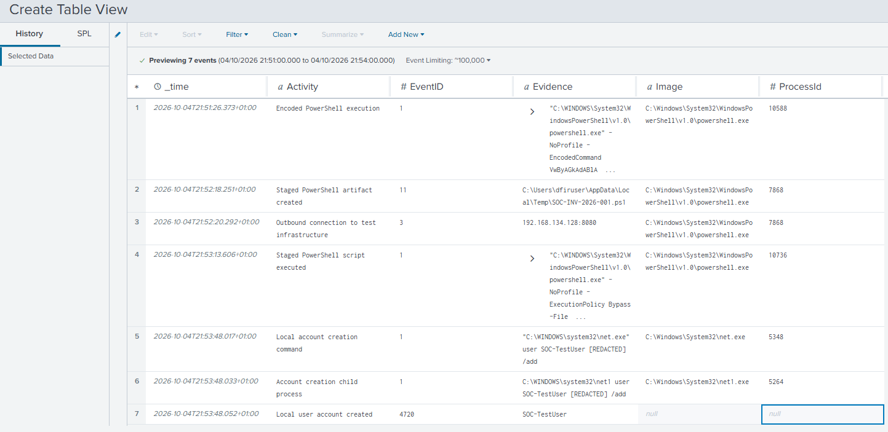
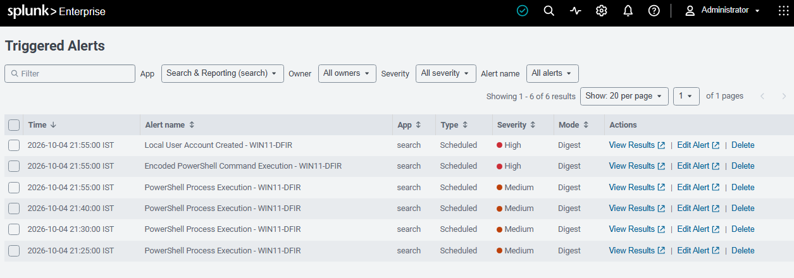

# Windows SOC Investigation

A hands-on SOC investigation using **Splunk Enterprise, Sysmon and Windows Security telemetry** to detect, investigate and respond to simulated suspicious PowerShell activity on a Windows endpoint.

This project focuses on the **investigation process rather than simply generating alerts**: validating an initial detection, scoping related activity, correlating multiple telemetry sources, reconstructing an incident timeline, mapping observed behaviour to MITRE ATT&CK and performing remediation.

> **Scenario:** Controlled security simulation conducted entirely within an isolated home lab. No malware or destructive payloads were used.

---

## Incident Overview

Splunk generated a high-severity alert after detecting PowerShell execution using an encoded command on `WIN11-DFIR`.

Investigation of the surrounding telemetry identified a related sequence of activity:

```text
Encoded PowerShell Execution
            ↓
PowerShell Network Activity
            ↓
PowerShell Script Written to %TEMP%
            ↓
Staged Script Execution
            ↓
net.exe → net1.exe
            ↓
Local Windows Account Created
```

The activity was reconstructed using **Sysmon process, network and file telemetry together with Windows Security events**.

**Final assessment:** High severity, High confidence, True Positive — Controlled Simulation.

---

## Investigation Timeline

[](screenshots/13-incident-timeline.png)

| Time | Event | Activity |
|---|---:|---|
| 21:51:26 | Sysmon 1 | Encoded PowerShell execution |
| 21:52:18 | Sysmon 11 | Staged PowerShell artifact created |
| 21:52:20 | Sysmon 3 | Outbound connection to controlled test infrastructure |
| 21:53:13 | Sysmon 1 | Staged PowerShell script executed |
| 21:53:48 | Sysmon 1 | Local account creation command |
| 21:53:48 | Sysmon 1 | Account creation child process |
| 21:53:48 | Security 4720 | Local user account created |

---

## Initial Detection

Three Splunk alerts provided context for the investigation:

- **Encoded PowerShell Command Execution — High**
- **Local User Account Created — High**
- **PowerShell Process Execution — Medium**

[](screenshots/06-incident-triggered-alerts.png)

The encoded PowerShell detection was used as the initial investigation point.

---

## Key Findings

### PowerShell Execution

Sysmon Event ID 1 recorded `powershell.exe` executing with `-EncodedCommand`.

The encoded argument was decoded during triage and determined to contain a benign command used as part of the controlled simulation.

### Network Activity

PowerShell PID `7868` subsequently established a TCP connection:

```text
192.168.134.129 → 192.168.134.128:8080
```

Sysmon Event ID 3 provided the process-level network telemetry.

### Staged Artifact

Sysmon Event ID 11 showed the same PowerShell process creating:

```text
C:\Users\dfiruser\AppData\Local\Temp\SOC-INV-2026-001.ps1
```

### Script Execution

The staged script was subsequently executed using:

```text
-NoProfile -ExecutionPolicy Bypass -File C:\Users\dfiruser\AppData\Local\Temp\SOC-INV-2026-001.ps1
```

### Local Account Creation

Process telemetry identified:

```text
powershell.exe
    ↓
net.exe
    ↓
net1.exe
```

Windows Security Event ID `4720` independently confirmed creation of `SOC-TestUser`.

---

## MITRE ATT&CK Mapping

| Technique | Name | Tactic |
|---|---|---|
| [T1059.001](https://attack.mitre.org/techniques/T1059/001/) | PowerShell | Execution |
| [T1105](https://attack.mitre.org/techniques/T1105/) | Ingress Tool Transfer | Command and Control |
| [T1136.001](https://attack.mitre.org/techniques/T1136/001/) | Create Account: Local Account | Persistence |

Only techniques directly supported by the collected evidence were mapped.

See the full [MITRE ATT&CK analysis](mitre/README.md).

---

## Analyst Assessment

**Severity:** High  
**Confidence:** High  
**Disposition:** True Positive — Suspicious/Malicious Activity (Controlled Simulation)

The assessment was based on the correlated behaviour rather than any individual alert:

- Encoded PowerShell execution
- PowerShell network communication
- PowerShell script creation in `%TEMP%`
- Execution using `ExecutionPolicy Bypass`
- Local account creation

The evidence did **not** establish credential theft, lateral movement, malware execution, data exfiltration or compromise of additional systems. These activities were therefore not attributed to the incident.

---

## Response and Remediation

The endpoint's post-incident state was preserved using a VMware snapshot before remediation.

The investigation then:

1. Verified that `SOC-TestUser` existed.
2. Confirmed that the account had no recorded logon.
3. Removed the local account.
4. Verified that the account no longer existed.
5. Verified the staged PowerShell artifact.
6. Removed the staged artifact.
7. Verified successful removal.
8. Confirmed account deletion through Windows Security Event ID `4726`.

---

## Detection Improvements

The investigation identified opportunities to improve detection fidelity through correlation rather than relying on isolated alerts.

Potential improvements include:

- Correlating encoded PowerShell with subsequent network activity.
- Detecting PowerShell file creation in user-writable directories.
- Correlating network activity with subsequent script execution.
- Increasing confidence when `ExecutionPolicy Bypass` appears alongside other suspicious PowerShell behaviour.
- Correlating local account creation with preceding `powershell.exe`, `net.exe` or `net1.exe` execution.
- Using ProcessGuid and parent-child relationships to strengthen process correlation.
- Baselining legitimate PowerShell activity to reduce false positives.

---

## Repository Structure

```text
windows-soc-investigation/
├── detections/
│   └── README.md
├── investigation/
│   ├── README.md
│   ├── incident-timeline.spl
│   └── investigation-searches.spl
├── mitre/
│   └── README.md
├── report/
│   └── README.md
├── scenario/
│   └── README.md
├── screenshots/
│   ├── README.md
│   └── investigation evidence
└── README.md
```

### Project Documentation

- [Investigation Scenario](scenario/README.md)
- [SOC Investigation](investigation/README.md)
- [Investigation SPL Searches](investigation/investigation-searches.spl)
- [Incident Timeline SPL](investigation/incident-timeline.spl)
- [Detection Logic](detections/README.md)
- [MITRE ATT&CK Mapping](mitre/README.md)
- [Incident Report](report/README.md)
- [Investigation Evidence](screenshots/README.md)

---

## Lab Environment

| System | Purpose |
|---|---|
| Windows 11 | Endpoint under investigation |
| Splunk Enterprise | SIEM, search and alerting |
| Sysmon | Endpoint process, network and file telemetry |
| Windows Security Auditing | Account-management telemetry |
| Kali Linux | Controlled test infrastructure |
| VMware Workstation | Virtualised lab environment |

The broader SOC/DFIR lab architecture and build are documented separately in my [Cybersecurity Home Lab](https://github.com/jcharcenko/cybersecurity-home-lab) project.

---

## Skills Demonstrated

- SOC alert triage
- Splunk investigation and SPL
- Windows endpoint investigation
- Sysmon analysis
- Windows Security event analysis
- Process-tree analysis
- Network telemetry analysis
- Event correlation
- Incident timeline reconstruction
- MITRE ATT&CK mapping
- Incident assessment
- Containment and remediation
- Detection improvement
- Technical incident reporting

---

## Related Project

This investigation builds on the telemetry, detections and lab infrastructure developed in:

**[Cybersecurity Home Lab — SOC & DFIR](https://github.com/jcharcenko/cybersecurity-home-lab)**

That project documents the underlying Splunk, Sysmon, Windows DFIR and Kali lab used to support this investigation.
