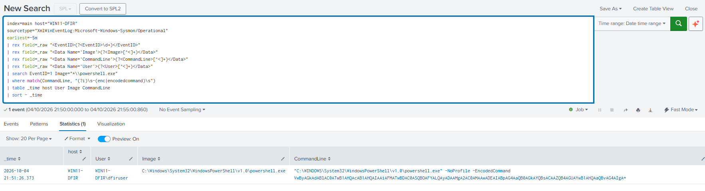
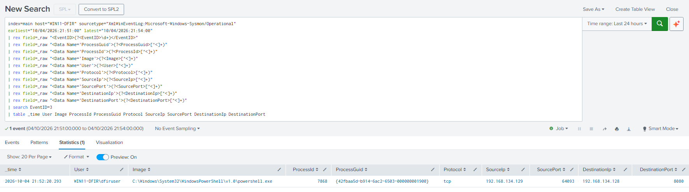
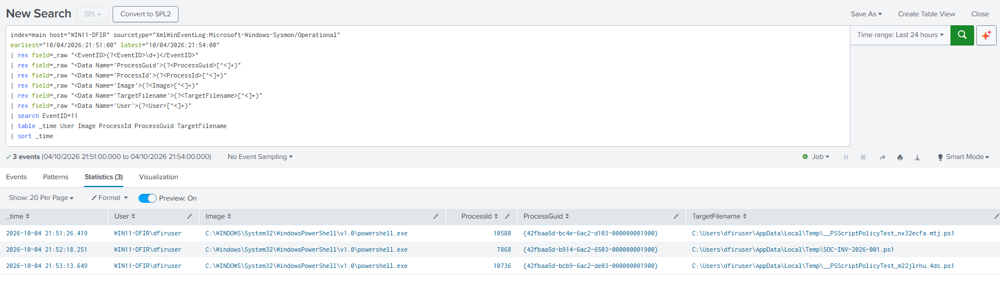
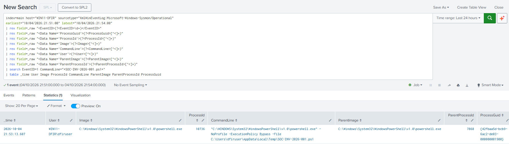
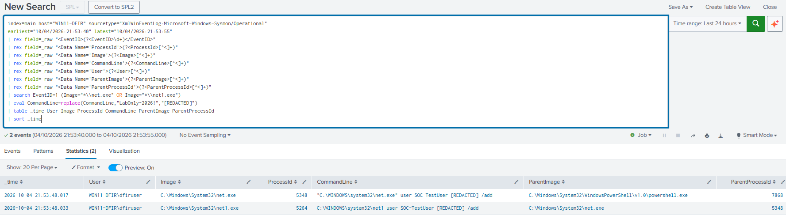

# Investigation Evidence

This folder contains selected evidence captured during the investigation of `SOC-INV-2026-001`.

The screenshots are presented in investigation order and support the findings documented in the incident report.

## 06 — Incident Alerts

[](06-incident-triggered-alerts.png)

Splunk generated multiple alerts associated with the simulated incident, including high-severity detections for encoded PowerShell execution and local account creation.

---

## 07 — Encoded PowerShell Alert

[](07-encoded-powershell-alert.png)

The initial investigation point. Sysmon process telemetry showed `powershell.exe` executing with the `-EncodedCommand` parameter on `WIN11-DFIR`.

---

## 08 — PowerShell Network Activity

[](08-powershell-network-activity.png)

Sysmon Event ID 3 identified PowerShell PID `7868` establishing a TCP connection from the Windows endpoint to the controlled test infrastructure at `192.168.134.128:8080`.

---

## 09 — File Creation Analysis

[](09-file-creation-analysis.png)

Sysmon Event ID 11 showed PowerShell creating `SOC-INV-2026-001.ps1` in the user's temporary directory.

Additional PowerShell-generated `__PSScriptPolicyTest` files were identified as background activity rather than incident artifacts.

---

## 10 — Staged Script Execution

[](10-staged-script-execution.png)

Sysmon process telemetry showed the staged PowerShell script being executed using `ExecutionPolicy Bypass`.

Parent process information linked the execution to the PowerShell process involved in the preceding activity.

---

## 12 — Account Creation Process Chain

[](12-account-creation-process-chain.png)

Sysmon process telemetry identified the process chain associated with local account creation:

```text
powershell.exe
    ↓
net.exe
    ↓
net1.exe
```

Sensitive lab credential data was redacted from the public-facing evidence.

---

## 13 — Reconstructed Incident Timeline

[](13-incident-timeline.png)

The final correlation search combined Sysmon and Windows Security telemetry to reconstruct the key incident sequence from encoded PowerShell execution through local account creation.

This timeline formed the basis for the final analyst assessment.
